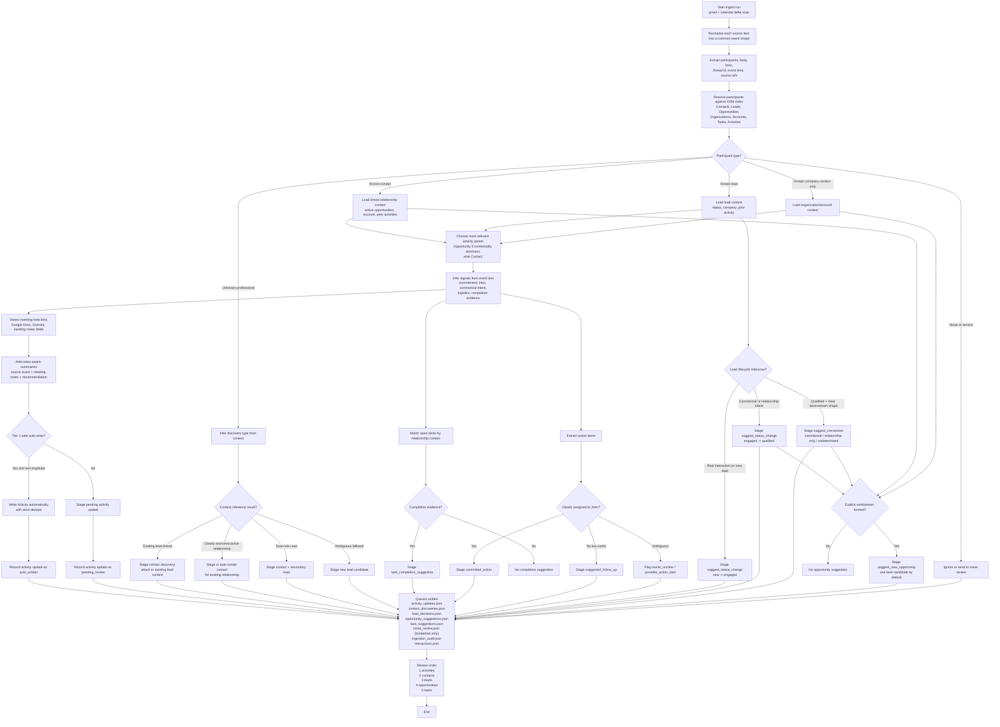

# CRM Ingest GWS Flowchart

```mermaid
flowchart TD
    A["Start ingest run<br/>gmail + calendar delta scan"] --> B["Normalize each source item<br/>into a common event shape"]
    B --> C["Extract participants, body, links,<br/>thread id, event time, source refs"]

    C --> D["Resolve participants against CRM index<br/>Contacts, Leads, Opportunities,<br/>Organizations, Accounts, Tasks, Activities"]
    D --> E{"Participant type?"}

    E -->|Known contact| F["Load linked relationship context<br/>active opportunities, account, prior activities"]
    E -->|Known lead| G["Load lead context<br/>status, company, prior activity"]
    E -->|Known company context only| H["Load organization/account context"]
    E -->|Unknown professional| I["Infer discovery type from context"]
    E -->|Noise or service| J["Ignore or send to noise review"]

    F --> K["Choose most relevant activity parent<br/>Opportunity if contextually dominant,<br/>else Contact"]
    G --> K
    H --> K
    I --> L{"Context inference result?"}

    L -->|Existing lead thread| M["Stage contact discovery:<br/>attach to existing lead context"]
    L -->|Clearly anchored active relationship| N["Stage or auto-create contact<br/>for existing relationship"]
    L -->|Dual-role case| O["Stage contact + secondary lead"]
    L -->|Ambiguous fallback| P["Stage new lead candidate"]

    K --> Q["Infer signals from event text<br/>commitment, intro, commercial intent,<br/>logistics, completion evidence"]
    Q --> R["Detect meeting-note links<br/>Google Docs, Granola, meeting-notes fields"]
    R --> S["Add notes-aware summaries<br/>source event + meeting notes + recommendation"]

    S --> T{"Tier 1 safe auto-write?"}
    T -->|Yes and non-duplicate| U["Write Activity automatically<br/>with strict dedupe"]
    T -->|No| V["Stage pending activity update"]

    U --> W["Record activity update as auto_written"]
    V --> X["Record activity update as pending_review"]

    Q --> Y["Match open tasks by relationship context"]
    Y --> Z{"Completion evidence?"}
    Z -->|Yes| AA["Stage task_completion_suggestion"]
    Z -->|No| AB["No completion suggestion"]

    Q --> AC["Extract action items"]
    AC --> AD{"Clearly assigned to John?"}
    AD -->|Yes| AE["Stage committed_action"]
    AD -->|No but useful| AF["Stage suggested_follow_up"]
    AD -->|Ambiguous| AG["Flag owner_unclear / possible_action_item"]

    G --> AH{"Lead lifecycle inference?"}
    AH -->|Real interaction on new lead| AI["Stage suggest_status_change<br/>new -> engaged"]
    AH -->|Commercial or relationship intent| AJ["Stage suggest_status_change<br/>engaged -> qualified"]
    AH -->|Qualified + clear downstream shape| AK["Stage suggest_conversion<br/>commercial / relationship-only / undetermined"]

    AJ --> AL{"Explicit workstream formed?"}
    AK --> AL
    F --> AL
    H --> AL

    AL -->|Yes| AM["Stage suggest_new_opportunity<br/>one best candidate by default"]
    AL -->|No| AN["No opportunity suggestion"]

    W --> AO["Write staged outputs"]
    X --> AO
    M --> AO
    N --> AO
    O --> AO
    P --> AO
    AA --> AO
    AE --> AO
    AF --> AO
    AG --> AO
    AI --> AO
    AJ --> AO
    AK --> AO
    AM --> AO
    J --> AO

    AO["Queues written<br/>activity_updates.json<br/>contact_discoveries.json<br/>lead_decisions.json<br/>opportunity_suggestions.json<br/>task_suggestions.json<br/>noise_review.json (borderline only)<br/>ingestion_audit.json<br/>interactions.json"] --> AP["Review order<br/>1 activities<br/>2 contacts<br/>3 leads<br/>4 opportunities<br/>5 tasks"]

    AP --> AQ["End"]
```
