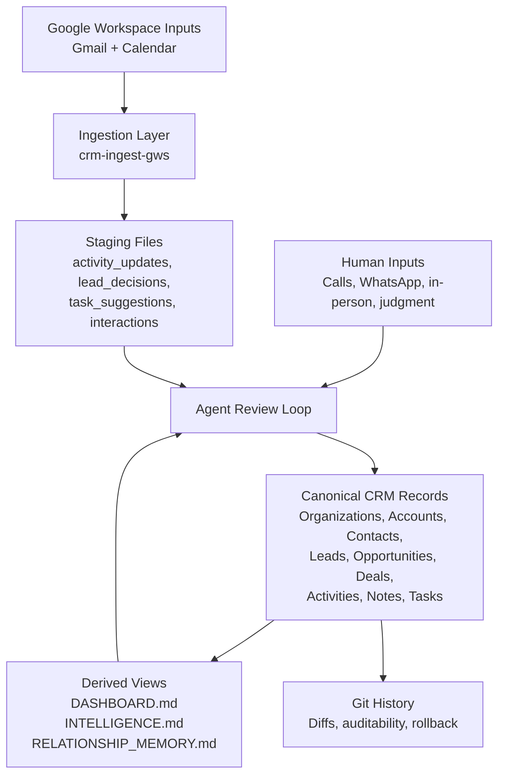
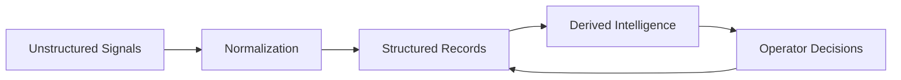
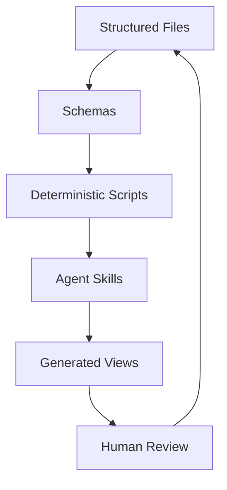

# CRM Logic as an LLM Knowledge Base

## Overview

This project is a domain-specific implementation of the broader idea behind Andrej Karpathy's "LLM Knowledge Bases": use an LLM and a set of deterministic workflows to continuously compile raw information into a durable, structured, inspectable knowledge base.

In Karpathy's framing, the important shift is architectural. The core artifact is not a chat transcript, a hidden agent state, or a vector database. The core artifact is a body of files that the model can read, update, synthesize, and refine over time.

This CRM project applies that pattern to one specific and operationally important domain: relationship management.

The result is not "AI on top of a CRM app." It is a CRM built as a knowledge base:
- the source of truth is a markdown vault
- entity records are explicit and versioned
- workflows are encoded as scripts and skills
- agents operate on the data, but do not own it
- the human remains in the loop for judgment-heavy decisions

## The Karpathy Connection

Karpathy's LLM Knowledge Base concept argues for a system where:
- the knowledge base is explicit and file-based
- the model incrementally compiles information into durable artifacts
- the artifacts survive across sessions and across model changes
- human users and models share the same memory substrate

This project follows the same pattern.

The CRM is split into two layers:
- `crm-data/`: the system of record, stored as markdown and generated support files
- `crm-logic/`: the workflow layer, containing templates, scripts, and skills that operate on the data

That means the CRM is not defined by an application server or a UI. It is defined by:
- schemas
- records
- transformation workflows
- generated views
- review loops

In that sense, this project is a concrete LLM Knowledge Base for commercial relationships.

## Same Pattern, Different Domain

### What is the same

This project shares the following core properties with a general LLM Knowledge Base:

1. The durable artifact is a file corpus

The important memory is not hidden inside the model. It lives in markdown files and generated artifacts such as:
- `Organizations/`
- `Accounts/`
- `Contacts/`
- `Leads/`
- `Opportunities/`
- `Deal-Flow/`
- `Activities/`
- `Notes/`
- `Tasks/`
- `DASHBOARD.md`
- `INTELLIGENCE.md`
- `RELATIONSHIP_MEMORY.md`

2. The model maintains the corpus

Agents do not only answer questions over the data. They:
- ingest Gmail and Calendar
- create activities
- discover contacts
- qualify leads
- convert leads
- update opportunities
- reconcile tasks
- score relationship warmth
- generate investor-deal matches

3. The corpus is human-readable

The memory system is legible without special infrastructure. A human can open a record, inspect a diff, or review a generated dashboard directly.

4. The corpus compounds

A meeting note can become an activity. An activity can update `last-contacted`. Linked activities and tasks can change warmth scores. A warmed relationship can influence investor matchmaking. The memory is cumulative.

5. The system is model-portable

Because the durable layer is files plus scripts, the operating model can survive changes in agent framework, prompt conventions, or model vendor.

### What is different

This CRM is not a general wiki or general-purpose note system. It is narrower and more operational.

The main differences are:

1. The schema is stronger

A general knowledge base can tolerate ambiguity. A CRM cannot. This project has explicit distinctions between:
- `Organization` and `Account`
- `Lead` and `Contact`
- `Deal` and `Opportunity`
- `Note` and `Activity`
- `todo`, `waiting`, and `completed`

These distinctions encode operating reality, not UI preference.

2. The workflows matter as much as the data

The repo is not just a store of files. It is a set of mutation paths. Examples:
- Gmail/Calendar ingestion
- lead conversion
- task reconciliation
- dashboard refresh
- relationship intelligence generation
- investor/deal matching

This makes the project closer to an operational memory system than a document store.

3. Human review is a first-class design constraint

In many enterprise "AI CRM" systems, automation is treated as the product. In this project, judgment is the product. Automation exists to stage, summarize, enrich, and propose. The human decides when commercial interpretation is required.

4. The generated views are operational, not decorative

`DASHBOARD.md` is not a report for curiosity. It is the operating queue.

`INTELLIGENCE.md` is not a vanity artifact. It is a relationship-scoring and warm-path surface.

`RELATIONSHIP_MEMORY.md` is not a dump. It is a compact cross-entity synthesis layer.

## Architecture

### High-level structure

### Layer model

Where:
- `Unstructured Signals` are emails, meetings, notes, and user updates
- `Normalization` is performed by skills and scripts
- `Structured Records` are the markdown entities
- `Derived Intelligence` includes dashboards, warmth, and matches
- `Operator Decisions` are the human-in-the-loop corrections and commercial judgments

## Entity Model

The CRM uses a structured memory model rather than a flat database of contacts and deals.

### Core entities

- `Organization`
  - Stable market entity
  - Owns identity, classification, and investor profile

- `Account`
  - Commercial relationship wrapper around an organization
  - Owns relationship-stage and strategic importance

- `Contact`
  - Durable person record
  - Links to an account and may link to a deal

- `Lead`
  - Pre-conversion relationship object
  - Default conversion path:
    - `Lead -> Organization + Contact + Account + Opportunity`

- `Opportunity`
  - Active mandate, advisory path, or commercial workstream
  - Operational center of gravity when active work exists

- `Deal`
  - Fundraising inventory object
  - Represents companies that can be matched to investors even absent a paid mandate

- `Activity`
  - Actual event or interaction
  - The event log of the relationship system

- `Task`
  - Explicit next action

- `Note`
  - Durable context and interpretation
  - Not raw intake

This entity split is central to the system's usefulness. It prevents the common CRM failure mode where one overloaded object has to represent identity, relationship, workflow, and fundraising all at once.

## Workflow Model

### Daily processing loop

The main operator loop is a human-guided review cycle:

1. Sync Workspace inputs
2. Stage proposals and discoveries
3. Ask for off-system updates
4. Reconcile tasks
5. Update live relationships
6. Refresh derived views

The important point is that ingestion does not directly become truth. It becomes proposed truth.

### Staging as a safety mechanism

The ingestion layer writes structured proposal queues such as:
- `activity_updates.json`
- `contact_discoveries.json`
- `lead_decisions.json`
- `opportunity_suggestions.json`
- `task_suggestions.json`
- `interactions.json`

This is a critical difference from many AI products. The model is allowed to observe and propose, but not silently reinterpret the operating record without review.

## Intelligence and Matchmaking

This project now includes a more explicit intelligence layer built on top of the CRM graph.

### Relationship warmth

Relationship warmth is not a vague score. It is computed from:
- recency of last real interaction
- linked activity count over a rolling window
- telemetry from ingested email/calendar interaction frequency
- task execution state

This creates a relationship-strength surface rather than just a log of touchpoints.

### Matchmaking

Investor/deal matching is not merely retrieval. It combines:
- sector taxonomy alignment
- geography fit
- fundraising stage fit
- raise-size fit
- explicit strategic references in CRM records
- relationship warmth bonus

This turns the CRM from passive storage into an actionable brokerage intelligence surface.

### Warm paths

Warm paths are derived from:
- credible deal-investor matches
- actual warm contacts already linked to those investor relationships

This is a good example of the knowledge-base architecture in action. The system does not just know that investor X fits company Y. It can also know whether the operator currently has a warm way in.

## Why This Is Better Than a Traditional CRM App

Traditional CRM systems are strong at:
- permissions
- reporting
- standardized pipeline workflows
- admin control

They are weak at:
- nuanced context
- durable narrative memory
- relationship interpretation
- unstructured evidence integration
- operator-specific workflows
- model-native interaction

This project makes a different tradeoff.

Instead of starting with an application database and bolting AI onto it, it starts with structured files and lets skills and agents operate over them.

That has several advantages:

1. Auditability

Every meaningful change is inspectable as a file diff.

2. Portability

The memory survives changes in model, tool, or UI.

3. Composability

Different agents can run different workflows over the same source of truth.

4. Legibility

A human can still operate the system directly.

5. Personal fit

The operating model can match one principal operator's actual way of working instead of flattening that behavior into generic CRM forms.

## Why This Still Needs Humans

A CRM is not just a fact store. It is a judgment system.

The hard questions are usually not:
- "Did an email arrive?"
- "Was there a meeting?"

The hard questions are:
- Is this person a lead or just a participant?
- Is this thread evidence of momentum or just courtesy?
- Is this commercial path real?
- Is this company an investor fit, or merely a sector match?
- Should this task close, move to waiting, or become something else?

That is why the project is intentionally built around human review loops. The system is agentic, but not autonomous in the strong sense.

This design is aligned with the reality that current LLMs are highly useful, but still unreliable enough that "trustworthy memory" requires explicit review points.

## Future Direction: CRM Without the App

The broader implication is that software like CRM may be moving away from the classic "database + UI" model.

The future architecture may look more like this:

In that world:
- the database is replaced by a durable knowledge corpus
- the app becomes a thin operating surface, not the source of truth
- workflows live as scripts and skills
- agents perform synthesis and mutation
- humans remain responsible for judgment and approval

This does not eliminate interfaces. It changes what interfaces are for. Instead of being the place where truth is created, they become windows into a deeper and more durable operating memory.

## Broader Implications

This project suggests a broader pattern beyond CRM.

Any domain that depends on:
- long-lived context
- structured entities
- recurring interpretation
- human review
- compounding memory

is a candidate for this architecture.

That includes:
- recruiting
- investment research
- legal matter management
- founder support
- advisory work
- customer success
- internal operating systems

The important idea is not "use LLMs for notes." The important idea is:

> build systems where the primary artifact is a durable knowledge base that both humans and agents can maintain together.

That is what this CRM already is in practice.

## Summary

Karpathy's LLM Knowledge Bases idea is a general pattern for AI-native software:
- durable files instead of opaque memory
- incremental compilation instead of one-shot chat
- shared human/agent substrate instead of hidden state

This project applies that pattern to CRM.

It is the same idea in spirit, but more opinionated:
- stronger schema
- more operational workflows
- more explicit mutation contracts
- more human review
- more emphasis on relationship judgment

The result is a vision of CRM that looks less like a SaaS product and more like a maintained, structured memory system.

The long-term implication is not just "better CRM automation."

It is that many categories of business software may eventually dissolve into:
- structured data
- schemas
- skills
- agents
- generated views
- human oversight

No monolithic app required.

## References

- VentureBeat summary of Karpathy's LLM Knowledge Bases framing:
  - [https://venturebeat.com/data/karpathy-shares-llm-knowledge-base-architecture-that-bypasses-rag-with-an](https://venturebeat.com/data/karpathy-shares-llm-knowledge-base-architecture-that-bypasses-rag-with-an)
- DAIR.AI summary of the same concept:
  - [https://academy.dair.ai/blog/llm-knowledge-bases-karpathy](https://academy.dair.ai/blog/llm-knowledge-bases-karpathy)
- Local project references:
  - [README.md](/Users/johnjanuszczak/Projects/crm-logic/README.md)
  - [AGENTS.md](/Users/johnjanuszczak/Projects/crm-logic/AGENTS.md)
  - [schema-spec.md](/Users/johnjanuszczak/Projects/crm-logic/docs/schema-spec.md)
